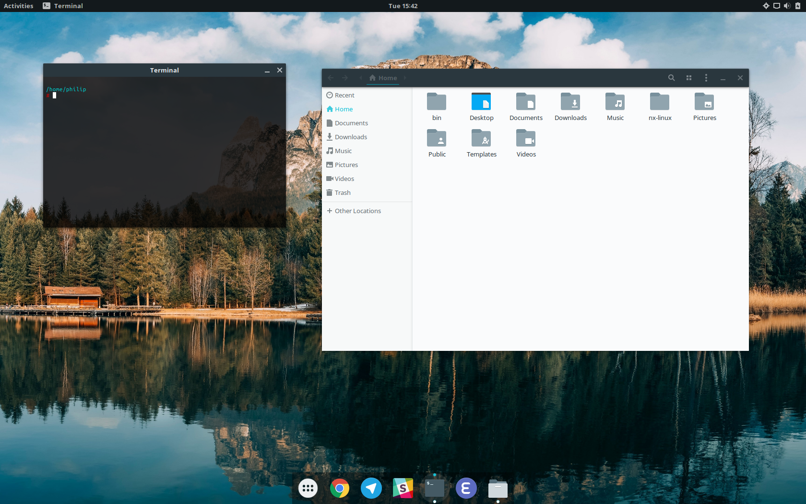

What is Neurix?
###############

Neurix is a Linux configuration script for Ubuntu GNOME 16.10. It configures the system for optimal performance, installs some software and removes some bundled software. It also sets up a beautiful theme, conventient keyboard shortcuts and more.
