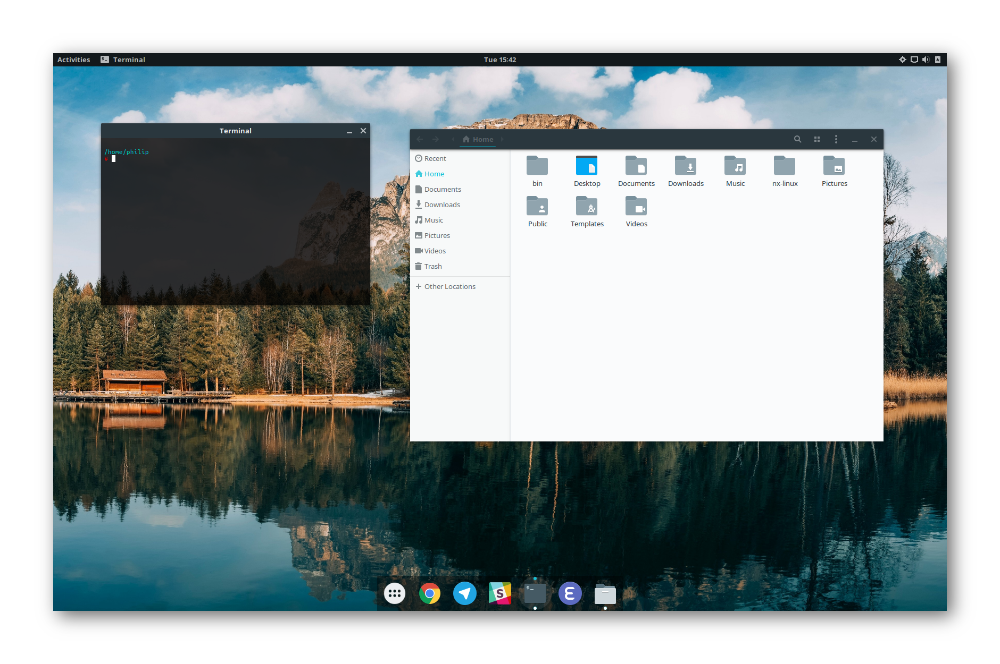

What is Neurix?
###############

Neurix is a Linux configuration script for Ubuntu GNOME 16.10.  It configures the system for optimal performance, installs some software and removes some bundled software.  It also sets up a beautiful theme, convenient keyboard shortcuts and more.

The installation is configurable to a great extent; you decide what parts of Neurix you want to install (for example, whether you want to use Google Chrome instead of Mozilla Firefox) and set up. You can easily modify the installation by deleting any nx-files associated with the components you want to exclude.
